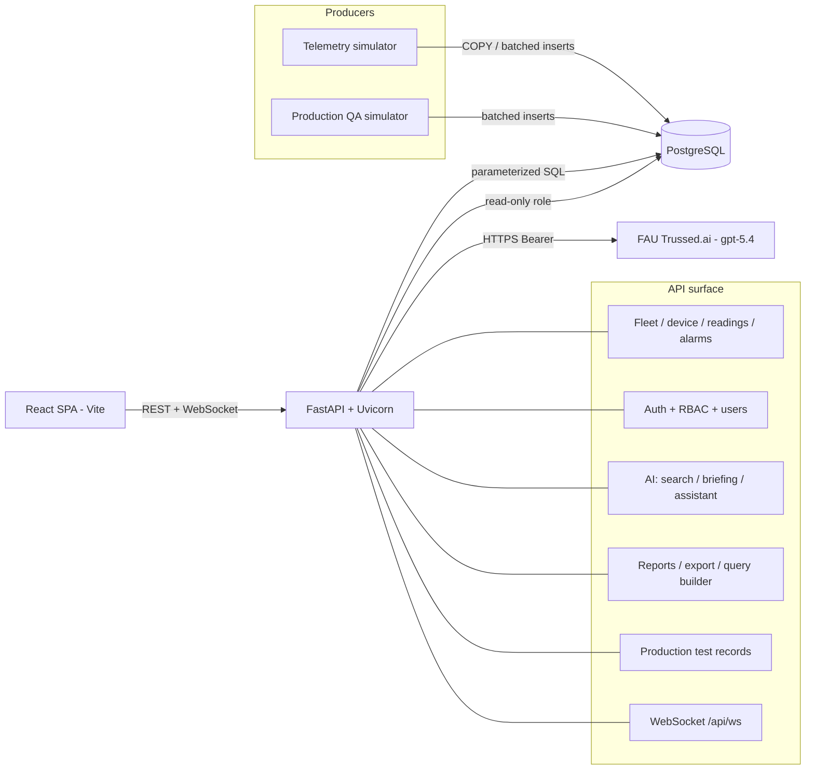
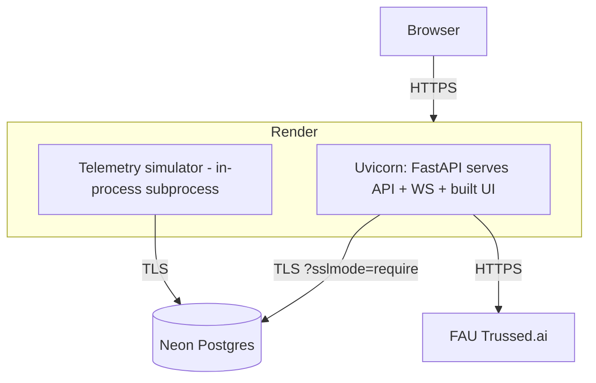
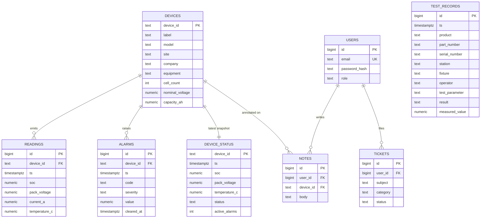
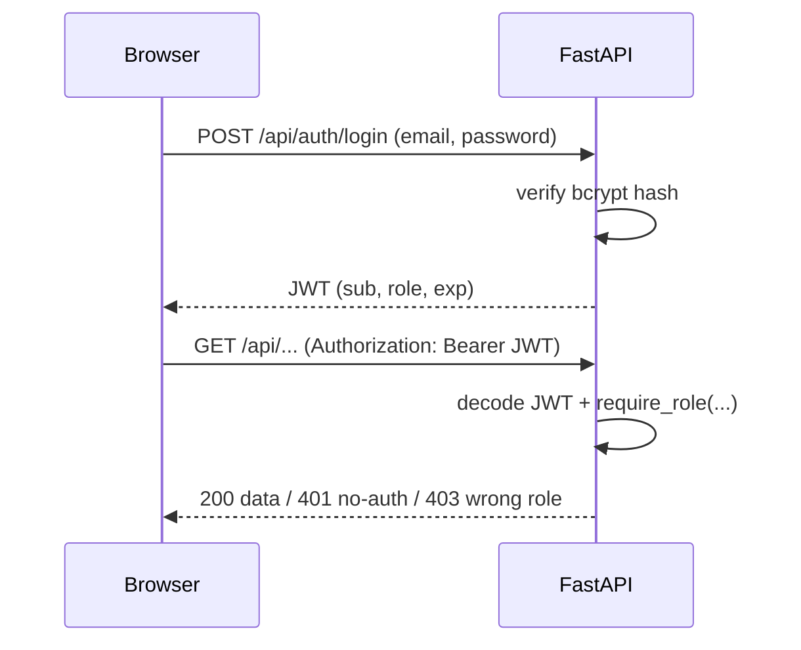

# Technical Design — Symbern Fleet Intelligence (BMS Cloud Dashboard)

**Author:** Joshua Lopez · Z23384309 · Joshualopez2016@fau.edu
**Companion doc:** [plan.md](plan.md) · deeper detail in [docs/](docs/) (DESIGN,
API_ENDPOINTS, SCALE, SECURITY, TESTING, PRODUCTION_SCOPE, DEPLOY).

---

## 1. System architecture

The simulator is the only writer; the API is read-oriented. One service (in
production) serves the API, the WebSocket, and the built UI.

**Two data domains, one shell** (switched by a Fleet ↔ Production toggle):
*Fleet Intelligence* (deployed packs) and *Production Test Records* (manufacturing
QA). The no-code query builder's data-source selector is the seam that lets one app
hold both.

## 2. Deployment architecture

Single Docker image (multi-stage: build React → Python runtime). Deployed free to
**Render** (web service) with **Neon** managed Postgres.

Configuration is entirely environment-driven (`DATABASE_URL`,
`READONLY_DATABASE_URL`, `JWT_SECRET`, `TRUSSED_API_KEY`, `RUN_SIMULATOR`), so the
same code runs locally, on-prem, or in the cloud with no changes.

## 3. Database schema

`device_status` is a denormalized "latest per device" cache so the fleet grid is an
O(fleet) read, never a scan of the large `readings` time-series.

Plus a **`daily_pack_report`** SQL view (one row per pack per day, every metric its
own column) and a `daily_pack_report_archive` table. Indexes: `readings
(device_id, ts DESC)`, a partial index on active alarms (`WHERE cleared_at IS
NULL`), and `test_records` indexes on serial / ts / product / result / station /
fixture.

## 4. API structure

RESTful, all JSON, all data endpoints authenticated (Bearer JWT). Full
request/response formats in [docs/API_ENDPOINTS.md](docs/API_ENDPOINTS.md).

| Group | Representative endpoints |
|---|---|
| Health / config | `GET /api/health`, `GET /api/config/thresholds` |
| Auth | `POST /api/auth/login`, `GET /api/auth/me`, `POST /api/auth/logout` |
| Users (admin) | `GET/POST/PUT/DELETE /api/users` |
| Fleet | `GET /api/fleet` (multi-filter/paginate), `/summary`, `/filter-options` |
| Device | `GET /api/devices/{id}`, `/{id}/readings?since=`, notes CRUD |
| Alarms | `GET /api/alarms?active=&severity=` |
| AI | `POST /api/ai/search`, `/ai/briefing`, `/assistant/chat` |
| Reporting | `GET /api/daily-report`, `GET /api/export/*.{csv,xlsx}` |
| Query builder | `GET /api/query/sources`, `POST /api/query/run` |
| Production | `GET /api/production/{records,summary,serial/{s},search}` |
| Realtime | `WS /api/ws?token=` |

## 5. Authentication & authorization flow

Roles: **viewer** (read-only), **engineer/supervisor** (may write notes),
**administrator** (also manages users). Enforced server-side via a
`require_role(...)` dependency — not merely hidden in the UI.

## 6. Key technical decisions

| Decision | Rationale |
|---|---|
| **FastAPI + sync `def` in a threadpool** | Simple, fast; pairs with a small pg8000 connection pool |
| **pg8000 driver (not psycopg)** | psycopg is LGPL (copyleft); pg8000 is BSD-3 → satisfies "no copyleft" |
| **Denormalized `device_status`** | Fleet grid reads one row/device instead of scanning millions of readings |
| **Thresholds in one config file** | Single source of truth shared by simulator (alarms) and API (UI colors) |
| **Whitelist query builder** | Users pick from a field registry; backend emits parameterized SQL → no injection |
| **Read-only DB role for the query builder** | Defense in depth — ad-hoc queries physically cannot write |
| **WebSocket broadcaster (one read → all clients)** | Cheaper than N clients polling; falls back to HTTP polling |
| **Bounded worst-first pages** | Payload/query cost stay flat as the fleet scales to thousands |
| **Single-service deploy** (API serves the built UI) | One free service, one origin, no CORS/WS cross-origin issues |
| **AI key server-side only** | LLM credential never reaches the browser; features degrade gracefully if unset |

## 7. Advanced topics — where each lives in the code

- **Auth & RBAC** — `backend/app/auth.py` (JWT, bcrypt, `require_role`), `UserAdmin.jsx`
- **Real-time (WebSockets)** — `main.py` broadcaster + `/api/ws`, `useFleetSocket.js`
- **AI / LLM integration** — `backend/app/ai.py`, `AiPanel.jsx`, `Assistant.jsx`
- **DB security & design** — parameterized queries throughout, `sql/roles.sql`
  (read-only role), `sql/schema.sql` (indexes, cache), `sql/daily_report.sql` (view)
- **No-code query builder** — `backend/app/querybuilder.py`, `QueryBuilder.jsx`
- **Testing** — `tests/test_api.py` (40 tests), `tests/bms_api.postman_collection.json`
- **Cloud deployment / DevOps** — `Dockerfile`, `render.yaml`, `docs/DEPLOY.md`
- **Data visualization** — `TrendChart.jsx` (Recharts, threshold reference lines)
- **Scale & efficiency** — bounded pagination + summary endpoints; results in
  [docs/SCALE.md](docs/SCALE.md)
- **Security self-certification** — [docs/SECURITY.md](docs/SECURITY.md)
