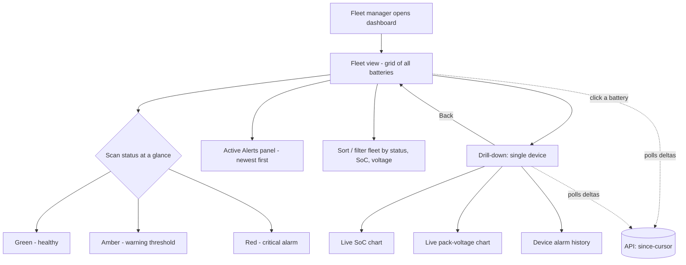
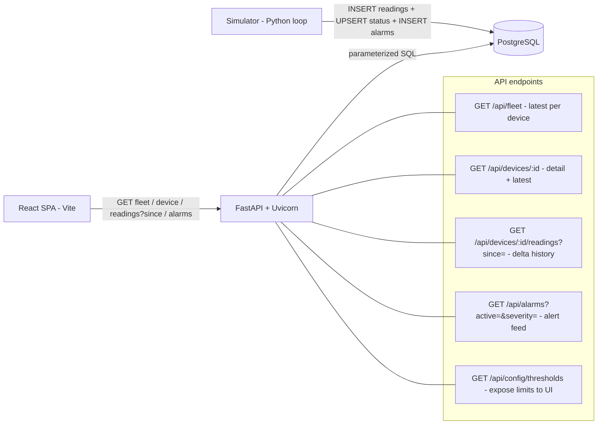

# Design & Planning — Cloud Dashboard for Battery Management Systems (BMS)

Author: Joshua Lopez · Z23384309 · Joshualopez2016@fau.edu

This document covers the goal, user flow, database schema, API architecture,
simulation model, and the scale/efficiency strategy for Project 2. It is the
plan of record; endpoint request/response detail will live in
[API_ENDPOINTS.md](API_ENDPOINTS.md) as those endpoints are built.

---

## 0. Goal & scope

A from-scratch, full-stack **Proof of Concept** dashboard where a fleet manager
watches battery health across **many** simulated devices at once — spotting
trends and critical alerts without reading raw telemetry. **All data is
simulated;** there is no real hardware and no Symbern customer data in this
project, so it can run and deploy entirely in the public/cloud track.

**Graded on:** pipeline integrity (real Simulator → DB → API → UI, nothing faked
at the UI layer), simulation realism (could swap in a real feed with minimal
rewrites), user experience (health at a glance + easy drill-down), and
efficiency (sensible fetching as the fleet grows).

**Committed choices**

- **Backend:** Python + **FastAPI** (Uvicorn).
- **Frontend:** **React** (Vite) + a permissively-licensed chart lib.
- **Database:** **PostgreSQL** (matches Symbern's stack).
- **Chosen stretch goal, designed in from day one:** **Scale & Efficiency** —
  a meaningfully large fleet with incremental (delta) fetching, not full-history
  refetch per tick.

**Explicitly out of scope** (per the brief): real hardware / real customer data,
authentication / multi-tenancy / roles (single-user view is fine), and
predictive ML. WebSockets and cell-level simulation are *optional* extras we may
layer on if time allows; the baseline uses polling.

---

## 1. User flow



Single-user, no login (auth is out of scope). The fleet grid is the home screen;
clicking any battery opens its drill-down with historical trend charts. Both
views **poll for deltas** (only data newer than the last timestamp seen), which
is the core of the efficiency story.

---

## 2. Database schema

Three tables plus one denormalized "current state" table. The split matters for
the scale goal: the fleet grid reads **one row per device** from
`device_status` (O(fleet size)), and never scans the large time-series
`readings` table.

```mermaid
erDiagram
    DEVICES ||--o{ READINGS : "emits"
    DEVICES ||--o{ ALARMS : "raises"
    DEVICES ||--|| DEVICE_STATUS : "has latest"

    DEVICES {
        text device_id PK "e.g. BMS-0421"
        text label
        text model
        text site "location / depot"
        int cell_count "for optional cell-level stretch"
        numeric nominal_voltage
        numeric capacity_ah
        timestamptz commissioned_at
    }
    READINGS {
        bigint id PK
        text device_id FK
        timestamptz ts "reading time"
        numeric soc "state of charge %"
        numeric pack_voltage "V"
        numeric current_a "load, + discharge / - charge"
        numeric temperature_c
    }
    ALARMS {
        bigint id PK
        text device_id FK
        timestamptz ts
        text code "LOW_SOC | LOW_VOLTAGE | OVER_TEMP | ..."
        text severity "info | warning | critical"
        numeric value "the reading that tripped it"
        timestamptz cleared_at "NULL = still active"
    }
    DEVICE_STATUS {
        text device_id PK_FK
        timestamptz ts "last update"
        numeric soc
        numeric pack_voltage
        numeric current_a
        numeric temperature_c
        text status "ok | warning | critical"
        int active_alarms
    }
```

- **`readings`** is the honest time-series of record — the simulator appends to
  it every tick. Composite index on `(device_id, ts DESC)` powers both
  drill-down history and `since`-cursor delta queries.
- **`device_status`** is a current-state cache the simulator **upserts** each
  tick, so the fleet grid is a single fast scan of ~fleet-size rows instead of a
  `GROUP BY` over millions of readings. This is a deliberate scale decision.
- **`alarms`** are stored as first-class rows with a severity and an optional
  `cleared_at`, so "active alerts" is a cheap `WHERE cleared_at IS NULL`.
- Alert **thresholds are NOT in the DB** — they live in a backend config file
  (see §4) so they're configurable in one place, per the brief.

Full DDL + indexes will live in [../sql/schema.sql](../sql/schema.sql).

---

## 3. API architecture



- **Clean separation of concerns:** the **simulator is a standalone process**,
  not code embedded in the API. The API only *reads*; the simulator only
  *writes*. That keeps the pipeline honest and makes "swap the simulator for a
  real feed" a drop-in change.
- **Incremental fetch is first-class:** `readings?since=<timestamp>` returns only
  newer rows. The frontend remembers the last `ts` it saw and asks for deltas on
  each poll — no re-fetching full histories per tick.
- **Security by construction:** every query is **parameterized** (no string
  interpolation); the DB connection string comes from an environment variable /
  `.env` that is **git-ignored** (never committed); responses are JSON only, so
  no raw simulated strings are ever injected as HTML (XSS hygiene lives on the
  React side, which escapes by default).
- Full request/response shapes and test cases: [API_ENDPOINTS.md](API_ENDPOINTS.md).

---

## 4. Simulation model (realism is graded)

Each device holds internal state and evolves it per tick, so the output looks
like a real battery rather than random noise:

- **State machine:** `discharging → low → charging → full → discharging`. SoC
  moves according to a load current; charge current is negative.
- **Voltage from SoC:** an open-circuit-voltage (OCV) curve maps SoC → resting
  voltage between `v_min` and `v_max`, then sags under load
  (`v = ocv(soc) − current_a × internal_resistance`). This is why voltage and
  SoC track each other believably.
- **Temperature** drifts with load and ambient, rising under heavy current.
- **Faults as consequences, not coin flips:** low SoC *causes* a `LOW_VOLTAGE`
  alarm; heavy sustained load can trip `OVER_TEMP`; a small random chance of an
  injected fault keeps the alert feed alive. Alarms clear when the condition
  recovers (`cleared_at` set).
- **Optional stretch (cell-level):** `cell_count` is already in the schema; if we
  add it, per-cell voltages are drawn around the pack mean and an imbalance alarm
  fires when spread exceeds a limit.

**Thresholds** (single source of truth): `backend/config/thresholds.py`, e.g.

| Signal | Warning | Critical |
|---|---|---|
| State of charge (%) | < 25 | < 10 |
| Pack voltage (V) | < nominal × 0.92 | < nominal × 0.85 |
| Temperature (°C) | > 45 | > 55 |

The `GET /api/config/thresholds` endpoint serves these to the UI so the grid,
badges, and charts all color off the *same* numbers the simulator alarms on.

---

## 5. Scale & efficiency strategy (the chosen stretch)

| Concern | Approach |
|---|---|
| Fleet grid at N devices | Read `device_status` (one row/device), never aggregate raw readings |
| History growth | `readings` indexed on `(device_id, ts DESC)`; queries bounded by `since` + `LIMIT` |
| Per-tick network cost | Delta polling — frontend sends `?since=<last ts>`, gets only new rows |
| Large fleet generation | Simulator batches inserts (one multi-row INSERT per tick, not per device) |
| Proof | Load-test with a config knob for fleet size (e.g. 1–5k devices) and record timings |

Baseline uses **polling**; if time allows, a `/ws` WebSocket can push the same
deltas without changing the data model. Because deltas are already the unit of
transfer, that upgrade is additive, not a rewrite.

---

## 6. Feature planning notes

| Feature | Problem it solves | How |
|---|---|---|
| Fleet grid | See every battery's health at a glance | `device_status` → color-coded status cards/rows |
| Drill-down + trend charts | Investigate one battery over time | `readings?since=` → SoC & voltage line charts |
| Active alerts panel | Surface critical conditions immediately | `alarms WHERE cleared_at IS NULL`, newest first |
| Configurable thresholds | Tune limits without touching UI code | `thresholds.py` + `/api/config/thresholds` |
| Delta polling | Keep the app efficient as the fleet grows | `since`-cursor on both views |
| Realistic simulator | Make a future real-feed swap trivial | State machine + OCV curve + consequence-driven alarms |

**Tech stack:** React (Vite) · FastAPI (Uvicorn) · PostgreSQL · a permissive
(MIT) chart library · a standalone Python simulator. Dependencies vetted for
`pip audit` / `npm audit` cleanliness and **no copyleft licenses**, per the
security checklist.

---

## 7. Repository layout

```
BMS-Cloud-Dashboard/
├── docs/            # this design doc, API_ENDPOINTS.md
├── simulator/       # standalone Python telemetry generator
├── backend/         # FastAPI app (read-only API) + config/thresholds.py
├── frontend/        # React (Vite) SPA
├── sql/             # schema.sql (DDL + indexes)
└── README.md        # run instructions + security self-certification
```

Clear separation of concerns (simulator / backend / frontend), as the
deliverables require.
